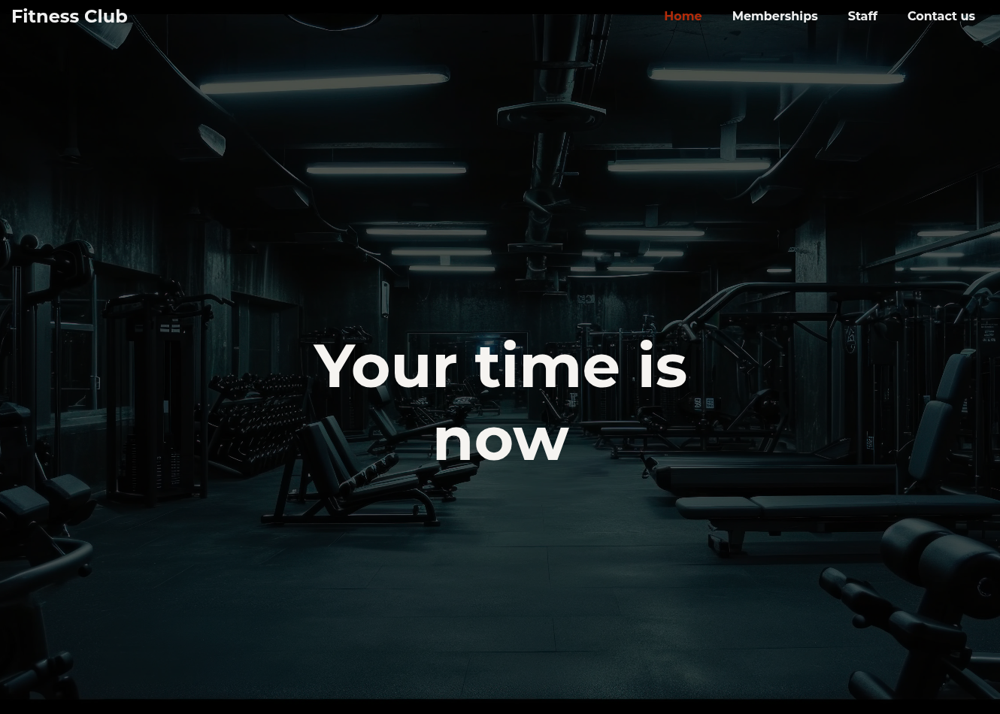
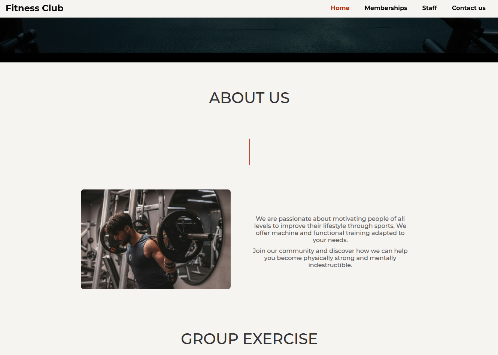
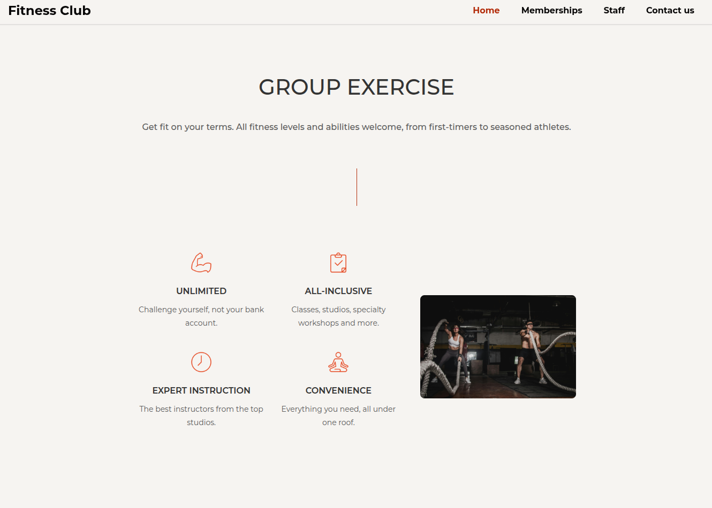
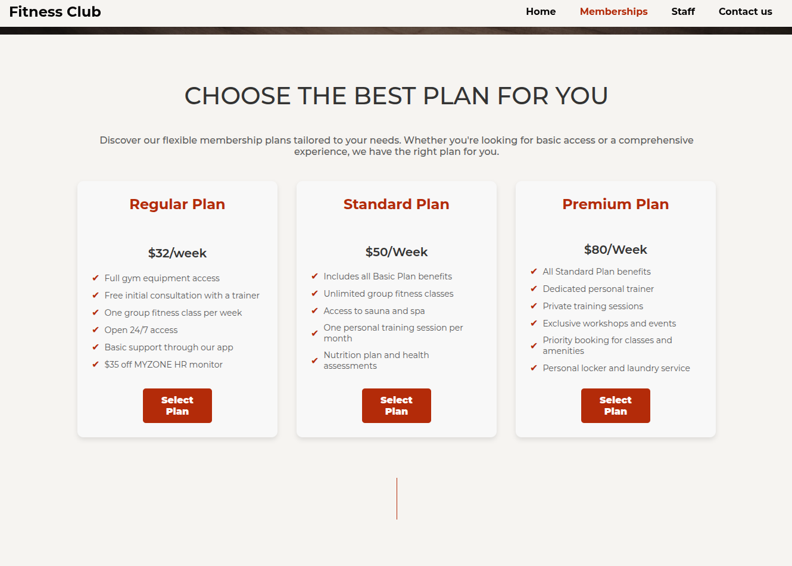
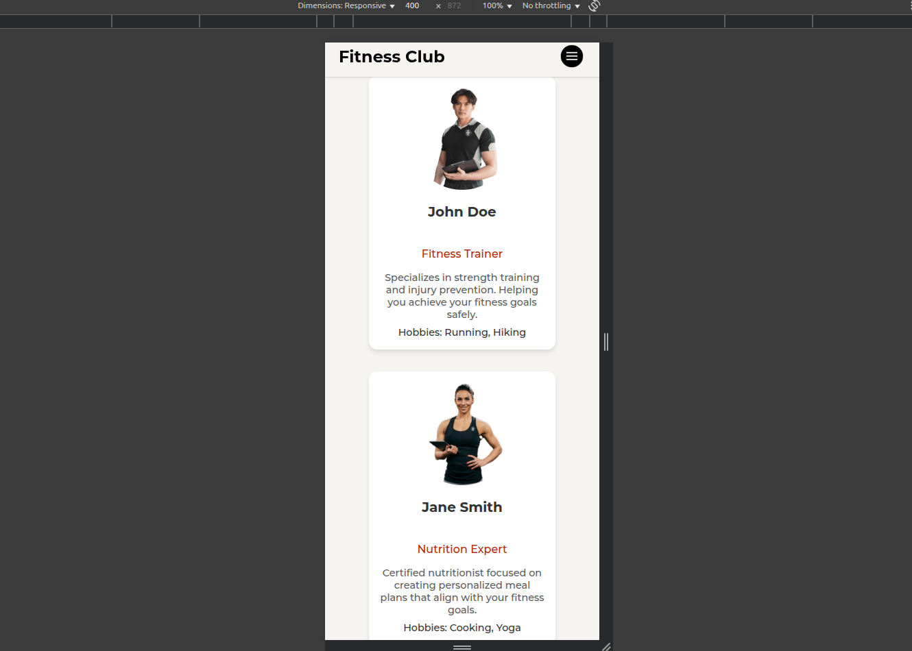

# Fitness Club Landing Page

A modern, responsive landing page designed for fitness clubs, showcasing amenities and services to attract new members and keep existing ones engaged.

## Project Value

- **Gets More Members:** A good-looking website helps more people join the gym.
- **Easy to Use:** Clear information and nice design make people want to stay and explore.
- **Works on All Devices:** Looks great on phones and computers, so everyone can use it.

## Technologies Used

- **HTML5**: For structured and semantic markup
- **CSS3**: To provide modern, responsive styling
- **JavaScript**: For interactive elements and smooth navigation

## Live Demo

[Visit the Fitness Club Landing Page](https://fitnessclubim.netlify.app)

## Screenshots

---

This landing page is an essential tool for any gym looking to improve its online presence and member acquisition.

---
